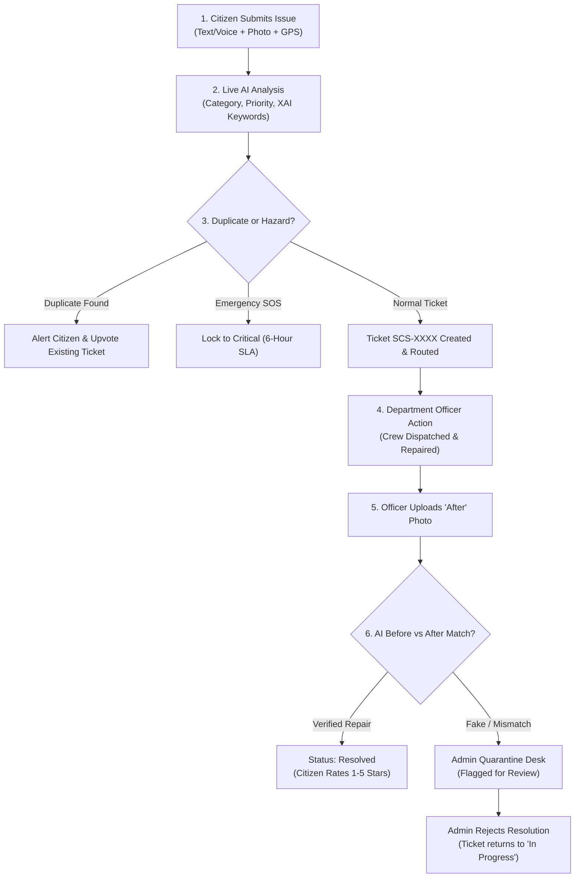
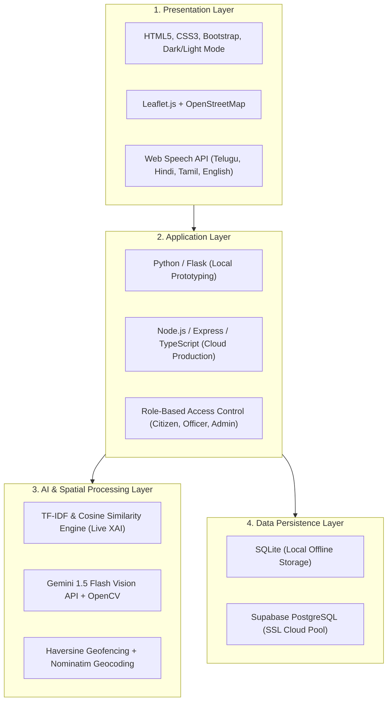

# Community Complaint Portal Using AI (SCS – Smart Civic System)
## Final Project Presentation Deck (18 Slides)

---

### Slide 1: Title & Project Metadata
**Layout:** Cover Slide with College Header, Project Title, Team, and Guide Credentials

* **Course Code:** R24MSCSP001 | **Regulation:** R24
* **Department:** Department of Data Engineering
* **Program:** B.Tech in Computer Science & Engineering (Artificial Intelligence & Machine Learning)
* **Semester / Section:** Semester V | Section A
* **Institution:** Maharaj Vijayaram Gajapathi Raj College of Engineering (Autonomous), Vizianagaram

#### **Project Title: Community Complaint Portal Using AI (Smart Civic System – SCS)**
**Batch Number:** [Insert Batch Number, e.g., Batch 12]

| S. No | Roll Number | Student Name |
| :---: | :---: | :--- |
| 1 | 24331A4247 | K. Deepthi |
| 2 | 24331A4224 | D. Tejas Reddy |
| 3 | 24331A4248 | K. Uma Sekhar |
| 4 | 24331A4201 | A. Tarun |

* **Project Guide:** Dr. S. Atchuta Rao, Professor, Department of Data Engineering
* **Project Coordinator:** Mrs. K. Amaravathi
* **Head of the Department:** Dr. V. Jyothi, Associate Professor, Department of Data Engineering
* **Date:** October 2026

> **Speaker Note (Slide 1):**  
> *"Good morning respected Guide, Project Coordinator, Head of the Department, and panel members. We are Batch [X] from CSE (AI & ML). Today, we present our Community Project: 'Community Complaint Portal Using AI', also known as the Smart Civic System (SCS)."*

---

### Slide 2: Abstract
**Layout:** 3 Visual Highlight Pillars + Key Performance Numbers

#### **The Core Problem:**
Traditional municipal grievance portals function merely as digital complaint inboxes. Routing is manual, duplicate reports clog departmental queues, and tickets are frequently closed with no verifiable proof of work.

#### **Our AI-Powered Solution:**
SCS is an intelligent, full-cycle civic governance platform that transforms raw public complaints into verified municipal work orders:
1. **Instant Real-Time Classification:** Analyzes complaint text as the citizen types and automatically routes it to the correct municipal department in under 20 milliseconds.
2. **Spatial Duplicate Prevention:** Uses GPS proximity and semantic text similarity to alert citizens if an issue was already reported nearby, reducing redundant crew dispatches.
3. **Computer Vision Proof of Work:** Uses multimodal AI to compare *Before* and *After* resolution photographs, preventing false closures.

#### **Key System Metrics:**
* 🏢 **10 Municipal Departments** automatically routed.
* 🗣️ **4 Regional Languages** supported with voice-to-text (Telugu, Hindi, Tamil, English).
* 🚨 **6-Hour Emergency SLA** for life-safety civic hazards via *Civic SOS*.
* 🌐 **100% Live & Functional** at `https://ccpai-1.ai.studio`.

> **Speaker Note (Slide 2):**  
> *"In summary, our system turns municipal complaint handling into a verified, transparent cycle. It listens to complaints in local languages, detects duplicates before they are submitted, and ensures an officer cannot mark an issue resolved without genuine photo evidence."*

---

### Slide 3: Introduction
**Layout:** 2-Column Overview (The Civic Challenge vs. The Smart Approach)

#### **The Civic Reality Today:**
* Citizens regularly encounter street-level civic issues: broken roads, uncollected garbage, water pipeline leaks, overflowing drains, and dark streetlights.
* Most citizens don't know which municipal department handles which issue, leading to wrong assignments, days of administrative delay, and citizen frustration.

#### **How SCS Modernizes Civic Administration:**
* **From Form-Filling to AI Decision Support:** AI extracts meaning directly from photos, descriptions, and GPS locations.
* **Inclusive Accessibility:** Built for diverse communities—citizens can speak in Telugu, Hindi, Tamil, or English using voice recognition.
* **Unified Single Dashboard:** Citizens, Department Officers, and Municipal Administrators share one transparent operational view.

> **Speaker Note (Slide 3):**  
> *"When a street light breaks or a pipe bursts, citizens often don't know which government department to contact. SCS bridges this gap by letting citizens speak or type naturally in their mother tongue, while AI handles all the backend classification and routing."*

---

### Slide 4: Problem Statement
**Layout:** Problem vs. Solution Comparative Table

| Existing Municipal Portals ❌ | Our Smart Civic System (SCS) 💡 |
| :--- | :--- |
| **Manual & Slow Routing:** Complaints sit in general queues for days before someone manually forwards them. | **Instant NLP Routing:** Text is classified in real time and sent straight to the responsible department officer. |
| **Duplicate Work Orders:** Multiple neighbors report the same pothole, wasting municipal budget and manpower. | **Spatial Duplicate Shield:** GPS radius ($\le 200\text{m}$) + text similarity warns the user and lets them upvote the existing ticket. |
| **Zero Proof of Resolution:** Officers mark tickets "Closed" without any inspection or proof. | **Vision-Based Proof of Work:** AI verifies Before vs. After repair photos before a ticket can be resolved. |
| **Language & Literacy Barriers:** Complex text forms exclude non-English or rural citizens. | **Multilingual Voice Support:** Native voice input in Telugu, Hindi, Tamil, and English. |

> **Speaker Note (Slide 4):**  
> *"Existing portals have three major flaws: manual delay, duplicate records, and no proof of work. SCS directly solves all three with real-time NLP, GPS-based duplicate detection, and AI photo auditing."*

---

### Slide 5: Project Objectives
**Layout:** 5 Clear, Measurable Goal Cards

1. **Instant AI Classification & Routing:** Classify unstructured complaints into 10 municipal categories and auto-assign them to the right departmental officers.
2. **Explainable AI (XAI) Transparency:** Show confidence percentages and highlighted keyword tags live to the citizen so AI recommendations are trustworthy and clear.
3. **Automated Duplicate Detection:** Compare incoming complaints with existing neighborhood reports using GPS distance and cosine similarity.
4. **Resolution Verification via Computer Vision:** Enforce mandatory resolution photos from officers and audit repair authenticity using AI Before/After matching.
5. **Open Governance & Public Auditing:** Provide an interactive City Heatmap, Wall of Impact, and public Open Data API (`/api/v1/complaints`).

> **Speaker Note (Slide 5):**  
> *"Our project goals focus on speed, fairness, and accountability. We ensure that every ticket is classified instantly, duplicates are avoided, and resolutions are backed by visual proof."*

---

### Slide 6: Project Scope
**Layout:** 4 Operational Boundary Pillars

* **1. User Roles & Access Control:**
  * **Citizen:** Voice/text submission, GPS map picker, status tracking, community upvoting, 1–5 star rating.
  * **Department Officer:** Department-specific dashboard, active directives, status update, mandatory resolution upload.
  * **Administrator:** City-wide control panel, Quarantine Special Attention Desk, SLA monitoring, geofencing.
* **2. Civic Coverage (10 Departments):**
  * Roads & Infrastructure, Water Supply, Electricity & Street Lighting, Sanitation, Drainage, Parks & Green Spaces, Public Property, Animal Control, Traffic Safety, Others.
* **3. Platform Architecture:**
  * Web application accessible across desktop and mobile browsers; responsive UI with dark/light mode toggle.
* **4. Emergency Governance (Civic SOS):**
  * Life-safety override locking the ticket to Critical priority with an emergency 6-hour response deadline.

> **Speaker Note (Slide 6):**  
> *"The project scope covers three clear roles—Citizen, Officer, and Admin—across 10 core civic departments, complete with dark mode, interactive maps, and a 6-hour emergency SLA."*

---

### Slide 7: Literature Review / Background Study
**Layout:** Structured Academic Synthesis Table

| Area | Prior Approach Studied | Key Takeaway Applied in SCS |
| :--- | :--- | :--- |
| **Text Classification** | Salton & Buckley (1988) — TF-IDF with n-grams [1] | Provides ultra-fast (<20ms), lightweight, and explainable feature extraction without heavy cloud GPU costs. |
| **Object Detection** | Redmon et al. (2016) — YOLO Architecture [2] | Accurate for local bounding boxes; complemented with Gemini Multimodal Vision API for zero-GPU cloud deployments. |
| **Explainable AI** | Ribeiro et al. (2016) — LIME / XAI Principles [3] | Trust requires transparent reasoning: confidence percentages and influential keyword tags are displayed live as the user types. |
| **Multimodal Vision** | Google Gemini Multimodal Models (2023) [4] | Enables deep image-and-text reasoning for Before/After repair verification and detecting fake/synthetic images. |

> **Speaker Note (Slide 7):**  
> *"Our literature review directly guided our architecture: we used TF-IDF for sub-20ms explainable classification, and combined OpenCV with the Gemini Vision API so our system can run on any lightweight cloud server without requiring costly GPUs."*

---

### Slide 8: Data Gathered / Data Used
**Layout:** 4 Data Modalities Overview

1. **Text Modality:**
   * Citizen descriptions typed or dictated via Speech-to-Text.
   * Extracted n-gram keywords, predicted category, confidence score, and priority level.
2. **Image Modality:**
   * Citizen "Before" evidence photograph.
   * Officer "After" resolution photograph with AI match score.
3. **Geospatial & Time Modality:**
   * Device GPS coordinates (latitude, longitude) and interactive Leaflet map pin.
   * Reverse-geocoded street address powered by OpenStreetMap Nominatim.
   * Community geofence radius coordinates and automated submission timestamps.
4. **Lifecycle & Audit Activity Data:**
   * Status progression logs: `Pending` $\to$ `In Progress` $\to$ `Resolved` (or `Under Admin Triage`).
   * Community upvote counts, 1–5 star ratings, and administrative feedback.

> **Speaker Note (Slide 8):**  
> *"We handle four data types: text descriptions, evidence photos, GPS location coordinates, and an immutable audit timeline that records every action from submission to resolution."*

---

### Slide 9: Methodology & System Design — Flow Chart
**Layout:** 3-Stage End-to-End Visual Lifecycle

#### **Key Design Principle:**
If an officer uploads an invalid or mismatched photo, the **Admin rejects the resolution proof, NOT the citizen's complaint**. The ticket returns to `In Progress` for re-inspection.

> **Speaker Note (Slide 9):**  
> *"This flowchart illustrates our closed-loop process. Notice step 6: if an officer tries to upload a fake repair photo, AI flags it and sends it to the Admin Quarantine Desk. When the admin rejects the resolution, the ticket goes back to 'In Progress' so the work actually gets done."*

---

### Slide 10: Methodology & System Design — Block Diagram
**Layout:** Clean 4-Tier Architecture

> **Speaker Note (Slide 10):**  
> *"Our architecture is cleanly separated into 4 tiers: a multilingual web interface, an application engine with dual runtime support, an AI layer for instant text and vision processing, and a persistent database with Supabase PostgreSQL."*

---

### Slide 11: Implementation & Modules
**Layout:** Module Routing Table & Key Implementation Snippets

#### **1. Route & Module Architecture:**
| Module Name | Route Endpoint | Primary Function |
| :--- | :--- | :--- |
| **Citizen Portal** | `/submit_complaint` | Live XAI prediction preview, map picker, voice input, SOS toggle |
| **My Complaints** | `/view_complaints` | Citizen ticket tracking, community upvoting, rating & review |
| **Officer Portal** | `/department_dashboard` | Department-only queue, crew dispatch, resolution photo upload |
| **Admin Center** | `/admin` | City overview, department performance, directives broadcast |
| **Quarantine Desk** | `/admin/quarantine` | Triage of image mismatches and non-civic/fake submissions |
| **City Heatmap** | `/admin_heatmap` | Geographic density visualization of active civic hotspots |
| **Open Data API** | `/api/v1/complaints` | Public JSON endpoint for civic transparency and hackathons |

#### **2. Key Implementation Highlights:**
* **Instant Prediction:** Returns category, priority, and influential keywords in $<20\text{ms}$.
* **Audit Trail:** Every status change is logged into an immutable history timeline table.

> **Speaker Note (Slide 11):**  
> *"Every component is mapped to modular routes. In addition to standard portals, we implemented an Admin Quarantine Desk to catch fraud, and an Open Data API that enables municipal transparency."*

---

### Slide 12: Results & Demonstrated Outputs
**Layout:** Visual Showcase of 6 Working System Screens

*(Place the real cropped UI screenshots from Chapter 6 of your project report here)*

* **Screen 1: Landing & Home Page (`/`)**
  * Modern civic portal with quick navigation, role login, and active statistics banner.
* **Screen 2: Registration & Secure Login (`/login`)**
  * Session-based authentication distinguishing Citizen, Officer, and Admin privileges.
* **Screen 3: Citizen Dashboard (`/user_dashboard`)**
  * Real-time counters (Total, Pending, In Progress, Resolved) and civic tips.
* **Screen 4: Intelligent Complaint Form (`/submit_complaint`)**
  * Multilingual speech input buttons, interactive Leaflet map pin, and live XAI classification box.
* **Screen 5: Admin Command Center (`/admin`)**
  * 10 department operational cards, tactical directive dispatcher, and real-time SLA monitors.
* **Screen 6: Officer Department Dashboard (`/department_dashboard`)**
  * Filtered work orders, priority escalation tags, and "After" repair photo upload tool.

> **Speaker Note (Slide 12):**  
> *"Here are the demonstrated results of our running portal. From the citizen complaint form with Telugu voice input, to the Department Officer dashboard and the Admin Command Center, every module is fully functional and connected."*

---

### Slide 13: Impact Assessment
**Layout:** 3-Pillar Value Framework

#### **1. Technical Impact:**
* Eliminates heavy GPU dependencies by pairing lightweight TF-IDF n-grams with Google Gemini 1.5 Flash API.
* Sub-second end-to-end response times with automated audit trails.

#### **2. Social Impact:**
* **Bridging the Digital Divide:** Native voice recognition in Telugu, Hindi, Tamil, and English allows elderly and rural citizens to report problems effortlessly.
* **Life-Safety Protection:** The *Civic SOS* feature provides emergency 6-hour response prioritization for exposed live wires, open manholes, and major road collapses.
* **Public Trust:** Citizens see the actual resolution photo taken by the officer before the ticket is closed.

#### **3. Economic & Administrative Impact:**
* **Eliminates Duplicate Costs:** Prevents municipal teams from dispatching multiple crews to the same spot.
* **Cuts Administrative Hours:** Automates category triage and departmental routing, freeing city staff for on-ground work.

> **Speaker Note (Slide 13):**  
> *"Our project delivers three levels of impact: technically, it runs fast without expensive GPUs; socially, it welcomes citizens in their own languages; and economically, it saves city councils money by preventing duplicate crew deployments."*

---

### Slide 14: Challenges Faced & Engineering Solutions
**Layout:** Problem-Solution Engineering Cards

| Engineering Challenge | How Our Team Solved It |
| :--- | :--- |
| **High GPU Costs for Computer Vision** | Replaced resource-heavy local YOLO models on cloud servers with the lightweight Gemini 1.5 Flash API + OpenCV feature extraction. |
| **Overlapping Civic Responsibilities** (e.g., A burst water pipe damaging a road) | Added Multi-Department Keyword Detection that alerts the citizen to confirm the primary responsible agency. |
| **Fake or Unrelated Repair Photos** (e.g., resubmitting the old photo or random images) | Built an AI Before/After Comparison model that checks structural similarity and quarantines suspicious resolutions to the Admin Desk. |
| **Duplicate Reports from Neighbors** | Combined Haversine GPS radius checking ($\le 200\text{m}$) with semantic cosine similarity. |

> **Speaker Note (Slide 14):**  
> *"During implementation, we overcame real engineering challenges. For example, to avoid server GPU costs, we used Gemini Vision API, and to prevent officers from closing tickets with fake images, we built an AI Before/After image comparison check."*

---

### Slide 15: Conclusion
**Layout:** Key Takeaways Summary

* **Closed-Loop Accountability:** SCS transforms traditional passive complaint forms into an active, transparent civic lifecycle: *Report $\to$ Route $\to$ Resolve $\to$ Verify*.
* **Explainable & Practical AI:** Rather than treating AI as a black box, SCS provides confidence percentages and keyword evidence live to citizens.
* **Community-Centric Engineering:** With multilingual voice input, spatial duplicate prevention, and Civic SOS, the platform is designed for real communities in India.
* **Production-Ready & Live:** The system is verified, tested, and running live on the web at `https://ccpai-1.ai.studio`.

> **Speaker Note (Slide 15):**  
> *"In conclusion, SCS proves that AI can be applied practically to solve everyday community issues. It makes civic governance faster, transparent, and genuinely accountable to citizens."*

---

### Slide 16: Future Work
**Layout:** 4 Roadmap Enhancements

1. **Native Mobile App (Android & iOS):** Offline-first complaint drafting and real-time push notifications when repair status changes.
2. **WhatsApp & SMS Bot Integration:** Enable citizens to submit complaints simply by sending a photo and location pin over WhatsApp.
3. **Automated Municipal Drone & IoT Feeds:** Automatically detect street light outages and road cracks from municipal street cameras and IoT sensors.
4. **Predictive Civic Analytics:** Use historical complaint data to forecast seasonal drainage blockages and water shortages before they happen.

> **Speaker Note (Slide 16):**  
> *"Looking ahead, we plan to develop a dedicated Android app, introduce WhatsApp bot submission for wider accessibility, and integrate predictive analytics to forecast civic problems before they occur."*

---

### Slide 17: References
**Layout:** Standard IEEE Format Citations

* **[1]** G. Salton and C. Buckley, *"Term-weighting approaches in automatic text retrieval,"* *Information Processing & Management*, vol. 24, no. 5, pp. 513–523, 1988.
* **[2]** J. Redmon, S. Divvala, R. Girshick, and A. Farhadi, *"You only look once: Unified, real-time object detection,"* in *Proc. IEEE CVPR*, 2016, pp. 779–788.
* **[3]** M. T. Ribeiro, S. Singh, and C. Guestrin, *"‘Why should I trust you?’ Explaining the predictions of any classifier,"* in *Proc. ACM SIGKDD*, 2016, pp. 1135–1144.
* **[4]** Gemini Team, Google, *"Gemini: A family of highly capable multimodal models,"* *arXiv preprint arXiv:2312.11805*, 2023.
* **[5]** G. Bradski, *"The OpenCV Library,"* *Dr. Dobb's Journal of Software Tools*, 2000.

> **Speaker Note (Slide 17):**  
> *"Our architecture builds upon established research in NLP, Computer Vision, and Explainable AI as cited here."*

---

### Slide 18: Any Queries / Questions?
**Layout:** Concluding Slide with Live Demo Link & Contact Info

## **Thank You!**
### **Questions & Answers**

* 🌐 **Live Portal URL:** [https://ccpai-1.ai.studio](https://ccpai-1.ai.studio)
* 💻 **GitHub Repository:** [https://github.com/tejas9230/Community_Project](https://github.com/tejas9230/Community_Project)
* 🏫 **Department:** Department of Data Engineering, MVGR College of Engineering (Autonomous)
* 👥 **Team:** K. Deepthi | D. Tejas Reddy | K. Uma Sekhar | A. Tarun
* 🎓 **Guide:** Dr. S. Atchuta Rao, Professor

> **Speaker Note (Slide 18):**  
> *"Thank you for your time. We are now ready to demonstrate our live system and welcome any questions from the panel."*
